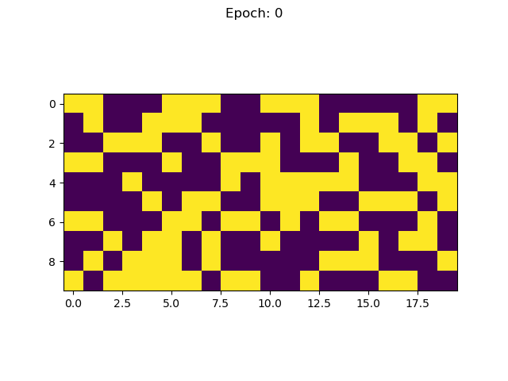

# Bernoulli Diffusion

## About

This is an implementation of the diffusion machine learning algorithm described in [Deep Unsupervised Learning using Nonequilibrium Thermodynamics](https://arxiv.org/abs/1503.03585). Notably, this implementation is designed to train on binary-valued data. It uses a Bernoulli distribution to generate noise instead of a Gaussian.

This repo generates a toy dataset called "heartbeat data," which is just period binary sequences of a fixed period and lengths. Here are two examples of period 5 and length 20 heartbeats:

```
    [0,0,1,0,0,0,0,1,0,0,0,0,1,0,0,0,0,1,0,0]
    [1,0,0,0,0,1,0,0,0,0,1,0,0,0,0,1,0,0,0,0]
```

The model trains on this heartbeat data and learns to generate samples via diffusion:



## Running this code

Make sure to create a Python3 environment and install the requirements in requirements.txt.

You can train a diffusion model on heartbeat data by simply executing the following command from the root directory of the project:

```
python main.py
```

The resulting model along with useful information about training will be stored in a folder named "results".

You can change various settings in config.yaml.

You can run unit tests from the root directory with the following commands:

```
# run all unit tests
python -m unittest discover BernoulliDiffusion/tests/

# run a particular file of unit tests
python -m unittest BernoulliDiffusion/tests/test_filename.py
```

## Overview of Files

* `main.py`: Run this to train a model according to the settings specified in the config
* `model.py`: Implements the architecture described in the original paper
* `train.py`: Contains Trainer, a class which trains the model
* `data.py`: Generates "heartbeat data," which is the toy dataset the model learns. It is periodic binary data with a random shift.
* `math_utils.py`: Contains some of the more elaborate calculations that are used by the diffusion model
* `plotting_utils.py` Contains some helper functions for making plots and animations
* Everything under `tests`: Unit tests to ensure various calculations and tools haven't broken


## Mathematics and Derivations

I wrote a whole blog post about the derivations which you can find [here](https://horenbergerb.github.io/2022/10/03/bernoulliderivations.html).

It contains notes on all of the trickier topics that I encountered while writing this code.