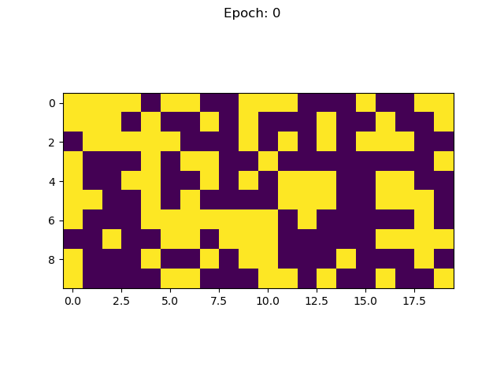

# Bernoulli Diffusion

## About

This is an implementation of the diffusion machine learning algorithm described in [Deep Unsupervised Learning using Nonequilibrium Thermodynamics](https://arxiv.org/abs/1503.03585). Notably, this implementation is designed to train on binary-valued data. It uses a Bernoulli distribution to generate noise instead of a Gaussian.

This model can be trained on any binary-valued data of fixed length. It will learn to generate samples which appear to be from the same distribution as the training data.

## Setup

Make sure to create a Python3 environment and install the requirements in requirements.txt:

```
python3 -m venv env
source env/bin/activate
pip3 install -r requirements.txt
```

## Usage

### Training

A working directory must be created with train.txt, val.txt, and a config.yaml file. See runs/heartbeat_len_20_per_5 for an example.

Once the working directory is prepared (let's use runs/heartbeat_len_20_per_5 as an example), you can train a diffusion model by simply executing the following command from the root directory of the project:

```
python train.py runs/heartbeat_len_20_per_5
```

The resulting model, its checkpoints, and training/validation data will be stored in runs/heartbeat_len_20_per_5/results/ under a timestamped directory.

#### Preparing Training Data

The training data stored in train.txt should satisfy the following criteria

* Each line is a single sample consisting of '1' and '0' and no other characters

The val.txt file satisfies identical criteria. It should only contain samples which are not in train.txt.

### Inferencing

You can generate an arbitrary samples from the reverse process of a model using the following command:

```
python generate.py runs/heartbeat_len_20_per_5/results/d_10_11_2022_t_17_20/checkpoints/model_epoch_29.pt 10
```

This command generates 10 samples from one of the models trained on heartbeat data.

### Using a Custom Reverse Model

You can alter the model in BernoulliDiffusion/reverse_model.py, and your changes will be reflected the next time you train. After each training, the python file for the reverse model will be saved in the results directory for reference.

### Validation and Analysis

After training, the The results.json file will contain all relevant data from the session, such as losses and validation data.

#### Validation Procedure

Currently the validation procedure is very rudimentary. To validate a model, a large collection of samples are generated from the reverse process. Then, we consider what proportion of them can be found in the training data, what proportion can be found in the validation data, and what proportion is found in neither. This provides basic insights about whether the model is learning to replicate the training data and may hint at whether the model is generalizing.

#### Visualizations

Training also produces some data and visualizations.

The first visualization is a simple loss curve:


The second visualization is a demonstration of samples produced by the same seed throughout training



The third visualization depics a rudimentary kind of validation. Given a large number of generated samples, it shows what proportion of them are from the training data, validation data, or neither. In this depiction, the proportions converge on 95/5/0, respectively, which matches the train/validate split perfectly. In other words, we trained a model which properly generalized.


### Unit Tests

You can run unit tests from the root directory with the following commands:

```
# run all unit tests
python -m unittest discover BernoulliDiffusion/tests/

# run a particular file of unit tests
python -m unittest BernoulliDiffusion/tests/test_filename.py
```

## Mathematics and Derivations

I wrote a whole blog post about the derivations which you can find [here](https://horenbergerb.github.io/2022/10/03/bernoulliderivations.html).

It contains notes on all of the trickier topics that I encountered while writing this code.